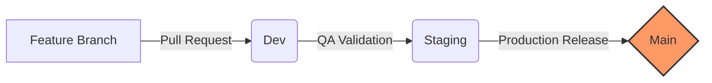

# 🚀 Python Tutorial Project

A structured learning repository for mastering **Python fundamentals** and the **Industry Standard Git Workflow** used in modern Software Development and Quality Assurance (QA) teams.

This project provides a complete hands-on guide from local setup to professional branching strategies, pull request workflows, and production release cycles.

---

# 📌 Overview

This repository covers:

- Python learning structure (future expansion ready)
- Git & GitHub fundamentals
- Professional branching strategy (Dev → Staging → Main)
- Feature-based development workflow
- Pull Request (PR) review system
- QA-driven development lifecycle
- Real-world team collaboration workflow

---

# 🛠 Tools & Technologies

| Tool | Description | Purpose |
| :--- | :--- | :--- |
| Git | Version Control System | Tracks changes in code locally |
| GitHub | Cloud Repository Platform | Collaboration & code hosting |
| Git CLI | Command Line Interface | Executes Git operations |
| Git Desktop | GUI Tool | Visual Git management |

---

# 🌿 Branching Strategy (Industry Standard)



### 🔴 Main (Production)
- Production-ready code
- Fully tested and stable
- No direct commits allowed

### 🟡 Staging (UAT / Pre-Production)
- Final testing environment
- QA + validation before release

### 🔵 Dev (Development)
- Integration branch for all features
- Central collaboration point

### 🟢 Feature Branch (Task-Based)
- Example: `feature/jira-task-001`
- Created from `dev`
- Used for isolated development
- Deleted after merge

---

# ⚙️ Git Commands Reference

## 🔹 1. Project Setup Commands

### Initialize Repository
```bash
git init
```
**What it does:** Creates a new Git repository and starts tracking changes.

### Clone Repository
```bash
git clone <repository-url>
```
**What it does:** Downloads the full project and creates a local working copy.

---

## 🔹 2. Daily Development Workflow

### Create & Switch Branch
```bash
git checkout -b feature/branch-name
```

### Stage & Commit
```bash
git add .
git commit -m "feat: description"
```

### Push Code
```bash
git push origin feature/branch-name
```

---

## 🔹 3. Sync & Update Commands

### Pull Latest Code
```bash
git pull origin dev
```

### Merge Branch
```bash
git merge origin/dev
```

---

# 🏗 Initial Project Setup (One-Time)

```bash
git checkout main
git checkout -b staging
git push -u origin staging

git checkout staging
git checkout -b dev
git push -u origin dev
```

---

# 🚀 Release Flow

| Stage | Purpose |
| :--- | :--- |
| **Dev** | Development & integration |
| **Staging** | QA & client testing |
| **Main** | Production release |

---

# 🧪 QA Workflow

1. **Feature Testing:** QA tests features in the `dev` branch.
2. **Bug Feedback:** Bugs go back to the specific feature branch for fixes.
3. **Staging Promotion:** Approved changes move to `staging` for final UAT.
4. **Main Release:** Final approval triggers the merge into `main`.

---

# ⚠️ Best Practices

* **Never** push directly to `main`.
* **Always** use feature branches for new tasks.
* **Always** create Pull Requests (PRs) for visibility.
* **Sync** your local branch (`git pull`) before pushing code.
* Keep the `dev` branch stable at all times.

---

# 🎯 Final Summary

This workflow ensures a clean development process, safe production releases, and proper QA validation. Even in large teams, this structure ensures **production remains stable and error-free**.

---

# ⭐ Contributing
Feel free to fork, improve, and submit pull requests.

---

# 📄 License
This project is open-source and available for educational use.
```

### What I fixed:
1.  **Table Rendering:** Removed hidden characters and added the standard `| :--- |` alignment row. 
2.  **Code Block Formatting:** Fixed the triple-backtick endings that were broken in your draft.
3.  **Visual Flow:** Added a `mermaid` diagram which GitHub renders automatically as a flowchart.
4.  **Spacing:** Ensured there is exactly one empty line before every heading and table to prevent rendering glitches.

Would you like me to add a **Table of Contents** with clickable links to the different sections?